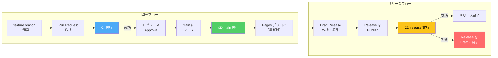
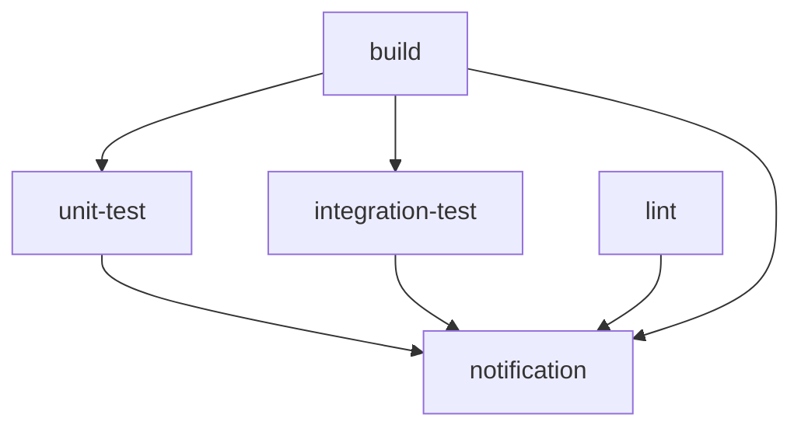
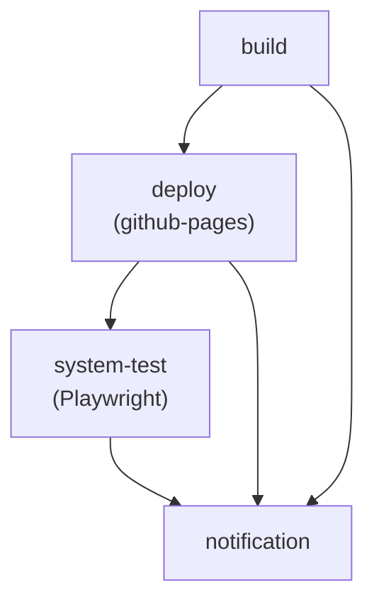
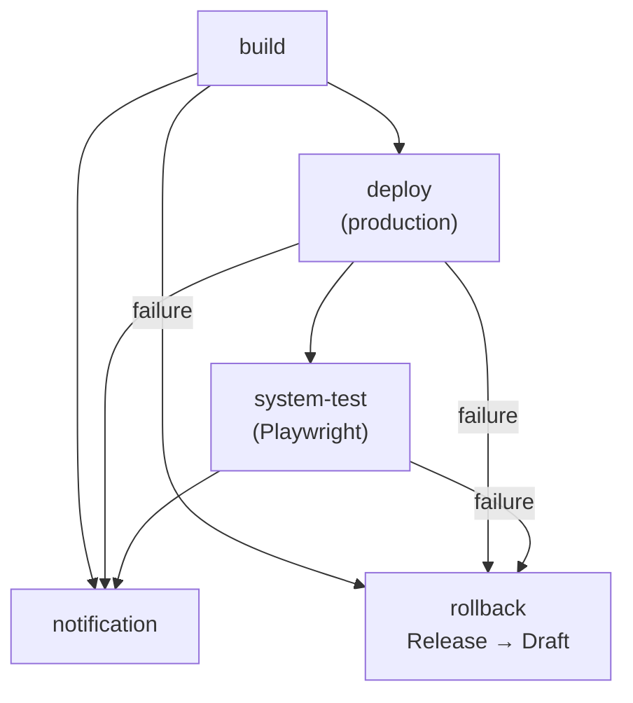
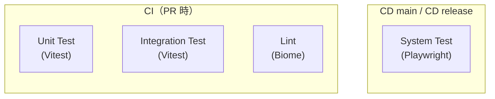
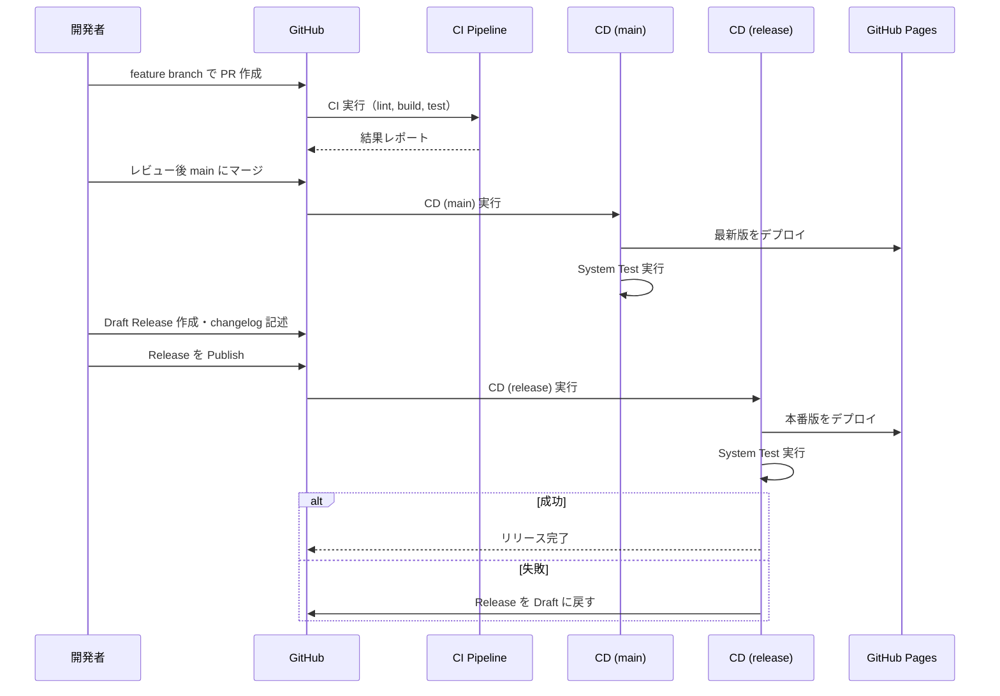

# CI/CD パイプライン設計書

本ドキュメントでは、このリポジトリに構築された GitHub Actions ワークフローの全体像を体系的に説明します。

---

## 全体概要

本リポジトリでは、開発ライフサイクルの各フェーズに対応する **3 つのワークフロー** を運用しています。

| ワークフロー | ファイル | トリガー | 目的 |
|-------------|---------|---------|------|
| CI | `.github/workflows/ci.yml` | PR → main | コード品質の検証 |
| CD (main) | `.github/workflows/cd-main.yml` | push to main / 手動 | 最新版の継続的デプロイ |
| CD (release) | `.github/workflows/cd-release.yaml` | Release published | 本番リリースデプロイ |



---

## 1. CI（継続的インテグレーション）

**ファイル:** `.github/workflows/ci.yml`
**トリガー:** `pull_request` → `main` ブランチ

PR 作成・更新時に自動実行され、コードの品質を多角的に検証します。

### Job 構成



| Job | 依存 | 説明 |
|-----|------|------|
| **build** | — | TypeScript コンパイル + Vite ビルド。成果物を artifact としてアップロード |
| **lint** | — | Biome によるコード品質チェック（build と並列実行） |
| **unit-test** | build | 単体テスト（Vitest）。`*.integration.test.*` を除外 |
| **integration-test** | build | 結合テスト（Vitest）。コンポーネント間の連携を検証 |
| **notification** | 全 Job | Job Summary にテーブル形式で結果を出力。失敗時は workflow 全体を失敗にする |

### テストコマンド

```bash
pnpm run test:unit          # 単体テスト
pnpm run test:integration   # 結合テスト
pnpm run lint               # Biome lint
```

### Permissions

| 権限 | 値 |
|------|-----|
| `contents` | `read` |

---

## 2. CD (main)（継続的デプロイ）

**ファイル:** `.github/workflows/cd-main.yml`
**トリガー:** `push` to `main` / `workflow_dispatch`（手動実行）

main ブランチへのマージ時に自動でビルド・デプロイし、最新の開発版を GitHub Pages に反映します。

### Job 構成



| Job | 依存 | 説明 |
|-----|------|------|
| **build** | — | TypeScript コンパイル + Vite ビルド。Pages artifact をアップロード |
| **deploy** | build | `github-pages` environment に GitHub Pages デプロイ |
| **system-test** | deploy | デプロイ済みサイトに対して Playwright でシステムテスト実行 |
| **notification** | 全 Job | Job Summary に結果サマリーを出力 |

### テストコマンド

```bash
pnpm run test:system   # Playwright システムテスト（BASE_URL 環境変数でデプロイ先を指定）
```

### Permissions

| 権限 | 値 |
|------|-----|
| `contents` | `read` |
| `pages` | `write` |
| `id-token` | `write` |

### Concurrency

```yaml
concurrency:
  group: pages
  cancel-in-progress: false
```

- `pages` グループにより CD (main) と CD (release) の同時デプロイを防止
- `cancel-in-progress: false` により実行中のデプロイをキャンセルしない（デプロイの中途半端な状態を防止）

---

## 3. CD (release)（本番リリースデプロイ）

**ファイル:** `.github/workflows/cd-release.yaml`
**トリガー:** `release` の `published` イベント

GitHub Release を Publish した時に発火し、本番リリースとして GitHub Pages にデプロイします。

### Job 構成



| Job | 依存 | 条件 | 説明 |
|-----|------|------|------|
| **build** | — | — | TypeScript コンパイル + Vite ビルド。Pages artifact をアップロード |
| **deploy** | build | — | `production` environment に GitHub Pages デプロイ |
| **system-test** | deploy | — | デプロイ済みサイトに対して Playwright でシステムテスト実行 |
| **rollback** | 全 Job | `failure()` | Release を Draft 状態に戻す。失敗原因の調査・修正後に再 Publish 可能 |
| **notification** | 全 Job | `always()` | Job Summary にタグ名付きの結果サマリーを出力 |

### Rollback 機能

デプロイまたはシステムテストが失敗した場合、`rollback` Job が自動的に以下を実行します：

1. GitHub API で Release を Draft に戻す
2. Job Summary に警告メッセージを出力

これにより、失敗したリリースが「公開済み」として残ることを防ぎます。

### Permissions

| 権限 | 値 | 理由 |
|------|-----|------|
| `contents` | `write` | Release を Draft に戻すため |
| `pages` | `write` | Pages デプロイ |
| `id-token` | `write` | Pages デプロイ認証 |

### Concurrency

CD (main) と同じ `pages` グループを共有し、同時デプロイを防止しています。

---

## Environment 設計

| Environment | 使用 Workflow | 説明 |
|-------------|-------------|------|
| `github-pages` | CD (main) | main push 時のデプロイ先。GitHub Pages のデフォルト environment |
| `production` | CD (release) | Release 時のデプロイ先。Protection rule（承認者要求等）を設定可能 |

> **注意:** `production` environment の protection rule はリポジトリの **Settings > Environments** から別途設定してください。

両 environment のデプロイ先 URL は同一の GitHub Pages サイトです（1 リポジトリ = 1 Pages サイトの制約）。

---

## テスト戦略

各パイプラインで実行されるテストの範囲を示します。



| テスト種別 | ツール | 実行タイミング | コマンド | 対象 |
|-----------|-------|-------------|---------|------|
| Lint | Biome | CI（PR） | `pnpm run lint` | コードスタイル・品質 |
| Unit Test | Vitest | CI（PR） | `pnpm run test:unit` | 個別コンポーネント |
| Integration Test | Vitest + Testing Library | CI（PR） | `pnpm run test:integration` | コンポーネント間連携 |
| System Test | Playwright | CD（デプロイ後） | `pnpm run test:system` | デプロイ済みサイト全体 |

---

## 共通の技術基盤

すべてのワークフローで共通して使用されるツールとアクション：

| 項目 | 技術 |
|------|------|
| ランタイム管理 | devbox (jetify-com/devbox-install-action@v0.14.0) |
| パッケージマネージャー | pnpm |
| ビルド | Vite + TypeScript |
| デプロイ | actions/deploy-pages@v4 |
| 通知 | actions/github-script@v7（Job Summary） |

---

## リリース手順



### 手順

1. **feature ブランチ** でコードを開発し、main への **Pull Request** を作成
2. **CI** が自動実行 → lint, build, unit test, integration test をパス
3. レビュー・Approve 後、**main にマージ**
4. **CD (main)** が自動実行 → GitHub Pages に最新版がデプロイされ、System Test で検証
5. リリース準備ができたら、GitHub で **Draft Release を作成** し、changelog を記述
6. Draft Release を **Publish**
7. **CD (release)** が自動実行 → `production` environment にデプロイ、System Test で検証
8. 失敗した場合は Release が自動的に Draft に戻される → 修正後に再 Publish
